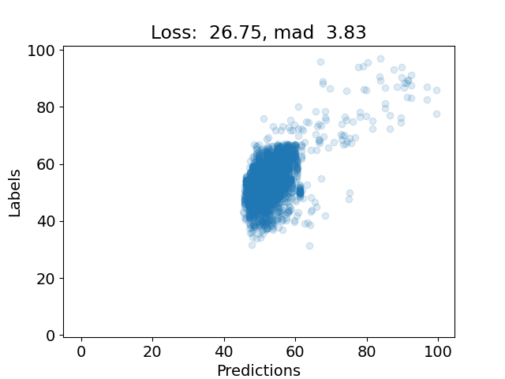
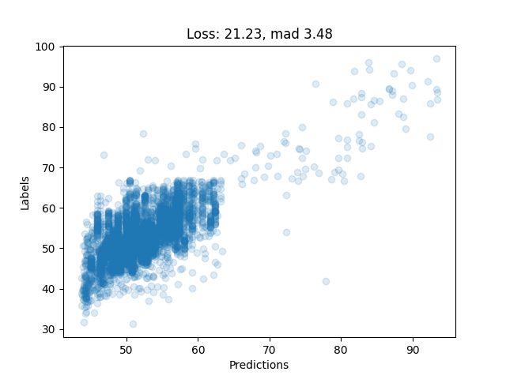

# HotProt - Part Deux
This repository contains the code and results of our [1st](https://github.com/LeonHermann322/hot-prot#old-content-semester-1) Programming Life with Deep Learning seminar project as well as our 2nd, which is a continuation of the first. 
In the first we attempt to predict protein thermostability using ESMFold embeddings. For that we use a custom dataset split that considers UniRef50 clustering and ESMFold/ESM2 pretraining.
In the second we compare that dataset split with that used in the [FLIP paper](https://www.biorxiv.org/content/10.1101/2021.11.09.467890v1), which to the day of the project start was the first published project attempting to predict the absolute thermostability from a given amino acid sequence.
We also switch to using only ESM2 language model and compare different training strategies (transfer learning, factorized sparse tuning, full fine tuning) on different model sizes. 

Take a look at the raw results in tabular form [here](https://docs.google.com/spreadsheets/d/1kvQ5HTotYYzatuVbeEC3KJjxD2CT6PJnxX8xMhdWSfk/edit?usp=sharing). Via the links to the wandb runs in that sheet you also find the command for running the corresponding experiment to reproduce the results.
The slides to our final presentation are found [here](https://docs.google.com/presentation/d/1cCd-xiZBGWxurgzb5PGClt625iiL-I8Awx7vKMT44gc/edit?usp=sharing), providing a higher level overview over our project.
The full report can be found [here](https://drive.google.com/file/d/1Yht0j3rZ-dSbUj-pgEOfIz5A0s0xRNQK/view?usp=drive_link)

# Copyright declaration
We reuse and modify the the source code of [ESM](https://github.com/facebookresearch/esm) created by Meta under the [MIT License](https://github.com/facebookresearch/esm/blob/2b369911bb5b4b0dda914521b9475cad1656b2ac/LICENSE). The same goes for code snippets for factorized sparse tuning from [HotProtein](https://github.com/VITA-Group/HotProtein). They also allow reuse via the [MIT License](https://github.com/VITA-Group/HotProtein/blob/9cf0cbaf4454d5b3b266e1eb9a7d1b5060e2bf15/LICENSE).

## Setup
These steps can be taken to setup the project on a linux machine.
1. Clone the repo with `git clone https://github.com/LeonHermann322/hot-prot.git --recurse-submodules`
2. Run `./install_dependencies.sh`. You need to add the path to your conda.sh file in the script. Or follow the different steps manually. The package `transformers` automatically installs a torch version that we don't want. That is why we have to uninstall it first, so we can install ours. That is also done in the script.
3. Activate conda enviroment with `conda activate hotprot`

### Imports
- If you are using vscode and want to work with jupyter notebooks, go into vscode setting and set Jupyter: Notebook File Root to `${workspaceFolder}`
- To make the relative imports work set the Env Variable to your current project dir, e.g 
```sh
export PYTHONPATH="$PYTHONPATH:/path/to/your/project/"
```

### Data
We have prepared a ZIP archive containing 
- all data required for generating our train, test and validation sets 
- (FROM SEMESTER #1) a pretrained model for ESM and ProtT5 representations
- (FROM SEMESTER #1) ESM per protein representation for all sequences in our train/validation/test set with a length < 700
- (FROM SEMESTER #1) ProtT5 per protein representation for all sequences in our train/validation/test set with a length < 700

1. Run data setup script: `bash setup_data.sh`. If this does not work, manually download the ZIP via [this link](https://drive.google.com/file/d/1Im3y2X6iwhZHFJLIOKbIGtZ0ZHBWaqD_/view?usp=sharing) and unzip the contents to the working directory (`unzip data.zip -d .`)
2. Generate our train/test set by executing all cells in [`create_datasets.ipynb`](data_analysis_generation/create_datasets.ipynb) Jupyter Notebook. This will create the HotProt, HotProt median and FLIP splits.

## Resouces
- [ESM2 language model paper](https://www.biorxiv.org/content/10.1101/622803v4)
- [ESM Github Repo](https://github.com/facebookresearch/esm)
- [UniProt Protein Embeddings](https://www.uniprot.org/help/embeddings)
- [UniProt Protein Embeddings Paper](https://ieeexplore.ieee.org/stamp/stamp.jsp?tp=&arnumber=9477085&tag=1)
- [FLIP Dataset](https://benchmark.protein.properties/)(the download link on their website might not work. In that case you can download the dataset from their github repo)
- [FLIP Dataset Paper](https://www.nature.com/articles/s41592-020-0801-4)
- [HotProtein Paper](https://openreview.net/forum?id=YDJRFWBMNby)


# Old content (Semester #1)
This project attempts to infer the thermostability (melting point) of a given protein sequence with an end-to-end approach, meaning no information other than the sequence is needed. For this we run a forward pass of the ESMFold model and infer the thermostability of the protein based on the ESMFold representations. We also implemented the same using the ProtT5 model representations.
With our pretrained model we have achieved a mean absolute difference (MAD) of 3.83°C and 3.49 between actual and predicted melting points over our test set for the ESMFold and ProtT5 embeddings respectively. 
As there are multiple melting point measurements for many of the different proteins, a MAD of 0°C would not be possible. 
In our test set, the MAD of the melting point measurements difference to its proteins mean melting point is `1.262`, which would consequently also be the MAD of a perfect model.

## Results
These are the predictions of our pretrained ESMFold model on the test set. 



Reproduce this via 

`python3 applications/train.py --batch_size=32 --epochs=30 --learning_rate=0.001 --model=summarizer --model_dropoutrate=0.5 --model_first_hidden_units=1024 --model_hidden_layers=2 --optimizer=adam --representation_key=s_s --summarizer_activation=identity --summarizer_mode=per_repr_position --summarizer_num_layers=1 --summarizer_out_size=1 --summarizer_type=average --val_on_trainset=false --wandb --early_stopping` 

(the results might be slightly different due to different model initialization). Make sure you have pregenerated the s_s representations for this. Only s_s_avg rerpresentations are included in the data.zip, because the file would be too large.

See the prediction on the same dataset with our ProtT5 model below:


This was achieved by running 

`python3 applications/train.py --batch_size=32 --dataset=pregenerated --epochs=50 --learning_rate=0.000025 --loss=weighted_mse --model=fc --model_dropoutrate=0.2878908626017538 --model_first_hidden_units=1024 --model_hidden_layers=4 --optimizer=sgd --representation_key=prott5_avg --val_on_trainset=false --weight_regularizer=false`.


## Resouces
- [ESM2 language model paper](https://www.biorxiv.org/content/10.1101/622803v4)
- [ESMFold paper](https://www.biorxiv.org/content/10.1101/2022.07.20.500902v2.full.pdf)
- [ESM Github Repo](https://github.com/facebookresearch/esm)
- [UniProt Protein Embeddings](https://www.uniprot.org/help/embeddings)
- [UniProt Protein Embeddings Paper](https://ieeexplore.ieee.org/stamp/stamp.jsp?tp=&arnumber=9477085&tag=1)
- [FLIP Dataset](https://benchmark.protein.properties/)(the download link on their website might not work. In that case you can download the dataset from their github repo)
- [FLIP Dataset Paper](https://www.nature.com/articles/s41592-020-0801-4)

## Setup
These steps can be taken to setup the project on a linux machine.
1. Clone the repo with `git clone https://github.com/LeonHermann322/hot-prot.git --recurse-submodules`
2. Run `./install_dependencies.sh`. You need to add the path to your conda.sh file in the script. Or follow the different steps manually. The package `transformers` automatically installs a torch version that we don't want. That is why we have to uninstall it first, so we can install ours. That is also done in the script.
3. Activate conda enviroment with `conda activate hotprot`

### Imports
- If you are using vscode and want to work with jupyter notebooks, go into vscode setting and set Jupyter: Notebook File Root to `${workspaceFolder}`
- To make the relative imports work set the Env Variable to your current project dir, e.g 
```sh
export PYTHONPATH="$PYTHONPATH:/path/to/your/project/"
```

### Data
We have prepared a ZIP archive containing 
- all data required for generating our train and validation sets 
- a pretrained model for ESM and ProtT5 representations
- ESM per protein representation for all sequences in our train/validation/test set with a length < 700
- ProtT5 per protein representation for all sequences in our train/validation/test set with a length < 700

1. Run data setup script: `bash setup_data.sh`. If this does not work, manually download the ZIP via [this link](https://drive.google.com/file/d/13g7uIYPGf45KcNRUXKzuCM_i4aibzu4X/view?usp=sharing) and unzip the contents to the working directory (`unzip data.zip -d .`)
2. Generate our train/test set by executing all cells in [`create_datasets.ipynb`](data_analysis_generation/create_datasets.ipynb) Jupyter Notebook

## Applications
For this all steps in **Setup** must have been executed successfuly.
### Inference
To run inference using our pretrained model, run [inference.ipynb](applications/inference.ipynb). You will be asked to input a protein sequence.
### Evaluation
To evaluate an existing model, you can use our [`eval` script](applications/eval.py).
E.g. `python applications/eval.py -m data/pretrained/prott5_avg/model.pt --representation_key=prott5_avg` 
Note that the model file specified after `-m` must be a pytorch module that takes an input of size `(batch_size, 1024)` and provides an output of size `(batch_size, 1)`. 
The results will be logged under `/results/eval`.
### Train
#### Single training run
To train a model with a hyperparameter specification, you can use our [`train` script](applications/train.py).
E.g. `python3 applications/train.py --batch_size=32 --epochs=5 --learning_rate=0.001 --model=fc --model_first_hidden_units=1024 --model_hidden_layers=2 --optimizer=adam --val_on_trainset=false --model_dropoutrate=0.3`
The results will be logged under `/results/train`.
#### Hyperparameter search

1. Edit the configuration in the `training/hyperparameter_esm.yaml` if you like to
2. Then run `wandb sweep training/hyperparameter_esm.yaml`
3. You'll be prompted to run the agent by wandb. You will also be provided with a link where you can see immediate results

### Generating representations
For generating ESM representations which can then be used for training, inference and evaluation, you can use our [`generate_esm_representations` script](data_analysis_generation/generate_esm_representations.py). 
It takes a text file with protein sequences seperated by newline as input and write the per protein representation (for each protein a vector of length 1024) to the specified output directory. 
For a given text file `./sequences.txt` with contents
```
MVAFLELTSDVSQPFVIPSLSPVSQPSSRKNSDANVDDLNLAIANAALLDASASSRSHSRKNSLSLL
MHPQLEAERFHSCLDFINALDKCHQKEYYKRIFGLCNNEKDALNKCLKEASLNNKKRAVIESRIKRADVEKRWKKIEEEEYGEDAILKTILDRQYAKKKQESDNDANSK
MDNKTPVTLAKVIKVLGRTGSRGGVTQVRVEFLEDTSRTIVRNVKGPVRENDILVLMESEREARRLR
```
the command could be executed ike `python data_analysis_generation/generate_esm_representations.py ./sequences.txt data/s_s_avg` with `data/s_s_avg` being the directory the representations will be written to (we call it `s_s_avg` because the variable in the ESMFold code and paper is called `s_s` and we are storing its average along the sequence axis).

## Known Errors 
1. `GLIBCXX_3.4.30' not found' - set your LD_LIBRARY_PATH to your conda environment, i.e 
```sh
EXPORT LD_LIBRARY_PATH=$LD_LIBRARY_PATH:/anaconda3/envs/hotprot/lib
```


